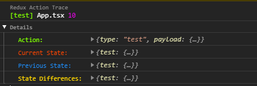
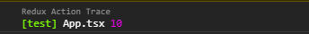

# redux-action-trace

[](https://www.npmjs.com/package/redux-action-trace) [](https://standardjs.com)

Sometime you have to call one action in different files or functions and you don't know which one has been called. That makes developing process painful and time consuming.

"redux-action-trace" is a middleware for redux that helps you to track down your redux actions by logging action name, caller file name and caller line number.

## Install

```bash
npm i redux-action-trace
```

or

```bash
yarn add redux-action-trace
```

## Usage

### redux

```tsx
import { createStore, applyMiddleware, combineReducers } from 'redux'
import thunk from 'redux-thunk'
import { reduxActionTrace } from 'redux-action-trace'

import { testReducer } from './reducer'

const middleware = applyMiddleware(thunk, reduxActionTrace)

const rootReducer = combineReducers({
  test: testReducer
})

const store = createStore(rootReducer, middleware)

export { store }
```

### redux-toolkit

```tsx
import { configureStore } from '@reduxjs/toolkit'
import { reduxActionTrace } from 'redux-action-trace'

import { testReducer } from './reducer'

const store = configureStore({
  reducer: {
    test: testReducer
  },
  middleware: (getDefaultMiddleware) =>
    getDefaultMiddleware().concat(reduxActionTrace)
})

export { store }
```

### configuration

```tsx
import { config } from 'redux-action-trace'

const reduxActionTrace = config({
  disable: false,
  style: {
    actionName: 'color: red; font-size: 24px;',
    path: 'color:blue;',
    lineNumber: 'font-size: 24px'
  }
})

const middleware = applyMiddleware(thunk, reduxActionTrace)
```

Options (with defaults):

```tsx
{
  /*
   boolean
   default : false
  */
  disable: false,

  /*
  {
   actionName: string;
   path: string;
   lineNumber: string;
  }
   default : {
     actionName: 'color: green;',
     path: 'color: white;',
     lineNumber: 'color: orange;'
   }
  */
  style: {
    actionName: 'color: red; font-size: 24px;',
    path: 'color:blue;',
    lineNumber: 'font-size: 24px'
  },

  /*
    {
    disable?: boolean
    style?: IStyle
    showDetails?: {
      collapsed?:boolean
      action?: boolean
      previousState?: boolean
      currentState?: boolean
      differences?: boolean
      order?: 'Action' | 'Previous State' | 'Current State'| 'State Differences' []
    }

    default :{
      collapsed:false,
      action: false,
      previousState: false,
      currentState: false,
      differences: false,
      order: ['Action', 'Previous State' ,'Current State','State Differences']
    }
  */
  showDetails: {
    collapsed:false
    action: true,
    currentState: true,
    previousState: true,
    differences: true,
    order: ['Action', 'Current State', 'Previous State', 'State Differences']
  }
}
```

## Result



Default



"[test]" is the action name.

"App.tsx" is the file name.

"12" is the line number.

## License

MIT © [ahmadbakhshi](https://github.com/ahmadbakhshi)
